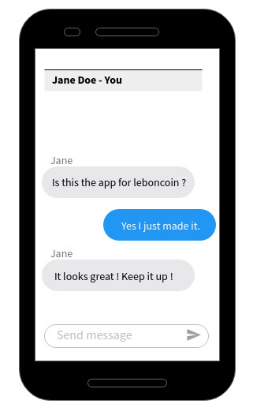

# START
Commands :
- npm install
- npm run dev (port 3000)
- npm run start-server (port 3005)

# API
- You can find the API swagger file in `docs/api-swagger.yaml`
- For a better readibility, you can view it on [https://leboncoin.tech/frontend-technical-test/](https://leboncoin.tech/frontend-technical-test/).

# Routes :

- "/"                                                     => Home Page including a list of the users
- "/conversations/:id": "/conversations?senderId=:id"     => Conversations Page
  "/conversation/:id": "/conversations?id=:id",           => Conversation Page
  "/messages/:id": "/messages?conversationId=:id"         => Messages Page
  "/message/:id": "/messages?id=:id",                     => Message Page
  "/user/:id": "/users?id=:id"                            => User Page

  # Types :

  All types are here : \src\types
  - conversations interface
  - message interface
  - user interface

  # Test :

  We are using React-testing librairies
  All test are here : \src\__tests__

# About the project
1 / I didn't know some next features so I had to study them
2 / I had difficulties for the calls to the API. I've started with the users and I should have change it in order to start with the conversations

# Exercice :

- Display a list of all the conversations
- Allow the user to select a conversation
  - Inside the conversation, there is a list of all the messages between these two users.
  - As a user, you can type and send new messages in this conversation

**As your application can be used by millions of users, make sure to provide some robust safety guards.**

### Sketches :

Obvisouly, it is up to you to make something nice and pretty, you are free to design it the way you like. The sketches are here to give you an idea on how it should look.

  
Click to see the sketches

  
Mobile list :

Desktop list :

Mobile conversation :

Desktop conversation :

### API :

You can find the API swagger file in `docs/api-swagger.yaml`.
              Start the API server on port 3005 by running npm run start-server
             

For a better readibility, you can view it on [https://leboncoin.tech/frontend-technical-test/](https://leboncoin.tech/frontend-technical-test/).

---

## Bonus 1 :

We provide some conversation samples, but can you improve the app so the user can now create new conversations ?

## Bonus 2 :

Our infrastructure is a bit shaky.. Sometimes the servers are crashing. “It’s not you, it’s me”, but maybe you can display something nice to warn the user and handle it gracefully.

## Do you want to make the app even better ?

Feel free to make as many improvements as you like.
We love creativity and technical challenges.

If you are out of ideas, here are some thoughts :

- As we want to reach our users anywhere, we need to make sure the app is performing well. What can you do to make it really fast ?

- Our goal is to support everybody in the country, including people with disabilities. As a good citizen and a good developer, can you make sure the app is accessible for everyone ?

- We all love to relax after a hard day’s work. It would be a shame if we didn’t feel confident enough about the upcoming automatic deployment. Are you sure everything has been tested thoroughly ?
